# Adding Your First Dataset
 

1. Go to **Datasets > Add New**.

    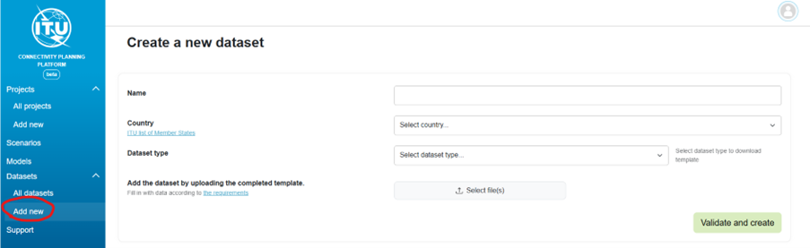

2. Enter the **Dataset Name**.

    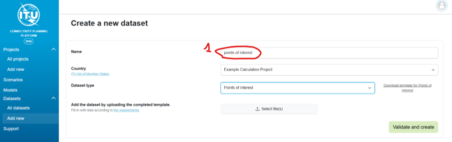

3. Select the **Country** (e.g., for the first example data upload, you can use "Example Calculation Project").

    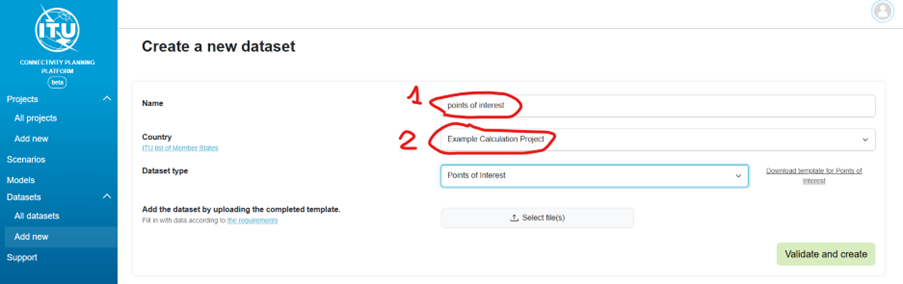

4. Select the **Dataset Type** from the dropdown list.

    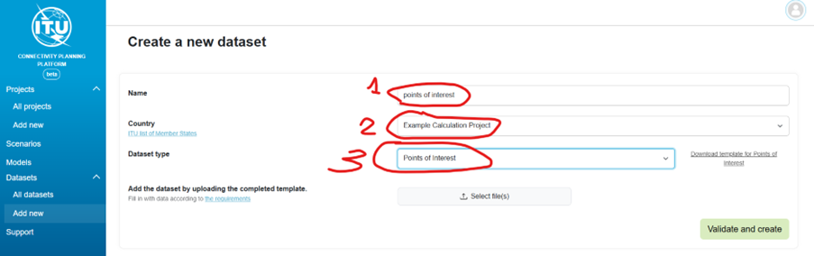

5. Download the template for the selected dataset type.

    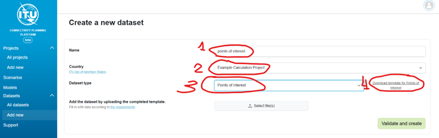

6. Fill in the template with data and save it.

    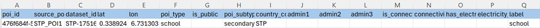

    You can also use example datasets provided by the following link to try the upload functionality: [https://fns-division.github.io/cpp-user-guide/inputdata/](https://fns-division.github.io/cpp-user-guide/inputdata/)

    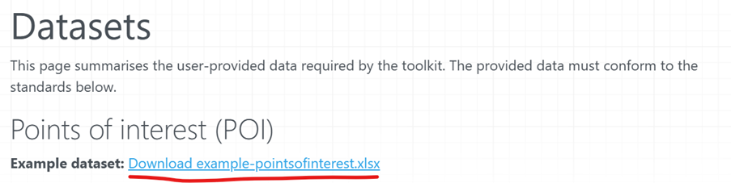

7. Press the **Select Files** button and upload the completed template.

    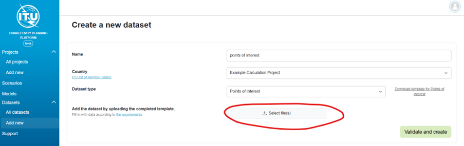

    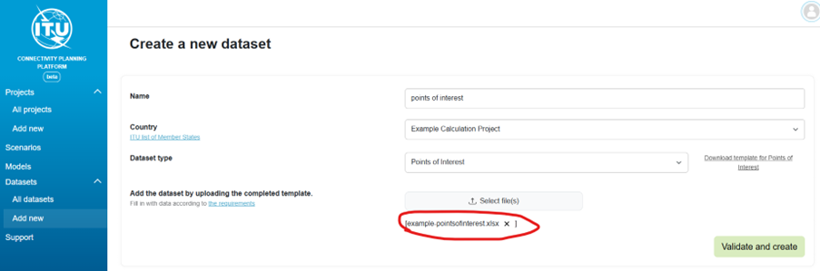

8. Click on **Validate and Create**.

    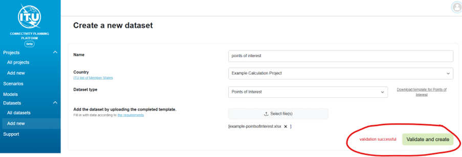

9. Check the notification for the validation status. (If successful, the dataset will appear in the dataset list.). Complete dataset validation might take 2-3 min.

    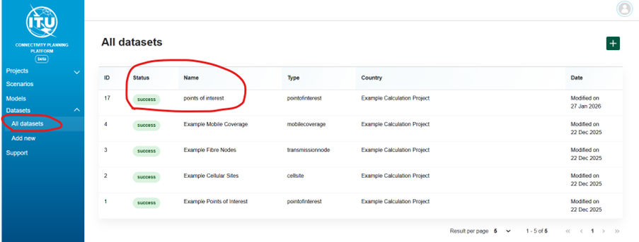

10. Note: If the dataset status is not updated in 3 minutes, you may need to (1) click on "All datasets" and (2) click on dataset name again to refresh the screen.

    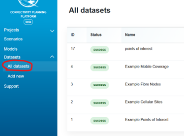

    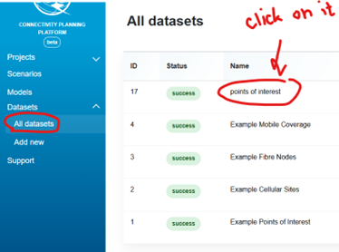
