# Creating Your First Project
 

1. Select **Projects / Add New** from the sidebar on the left.

    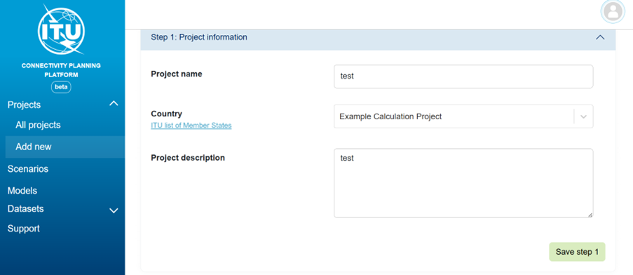

2. Enter the **Project Name**.

3. Select the **Country** (For your first example project, use **Example Calculation Project** instead of a specific country).

4. Add a **Project Description**.

5. Press **Save** (Step 1).

6. Select a **Scenario**.

    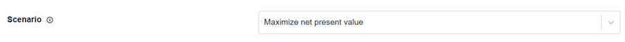

7. Select **Models**.

    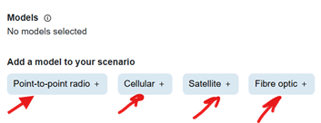

    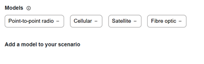

8. Save (Step 2).

9. Select **Datasets** (e.g., Example Mobile Coverage, Example Fibre Nodes, Example Cellular Sites, Example Points of Interest).

    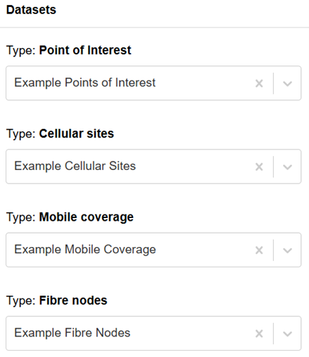

10. Save (Step 3).

11. Start the calculation.

    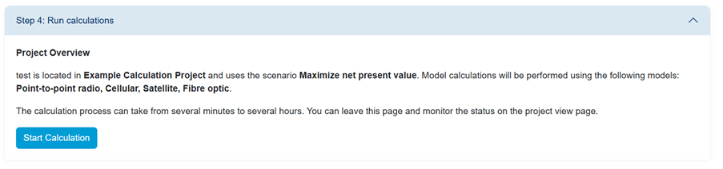

12. Go to **All Projects**.

    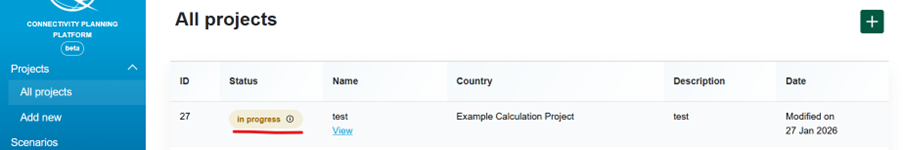

13. View your new project running. The calculation will take approximately 6-7 minutes.

14. Select **View**.

    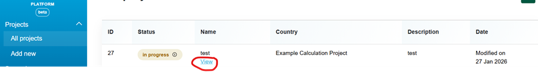

15. Once the calculation is complete, review the results.

    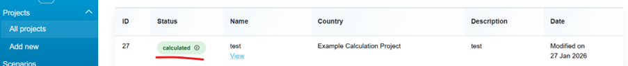

    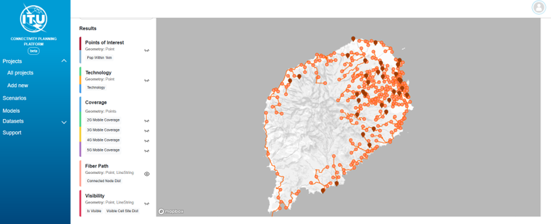

## Note

If the project status is not updated in 7 minutes, you may need to (1) click on "All Projects" and (2) click on "View" again to refresh the screen.

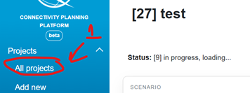

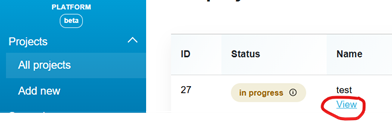