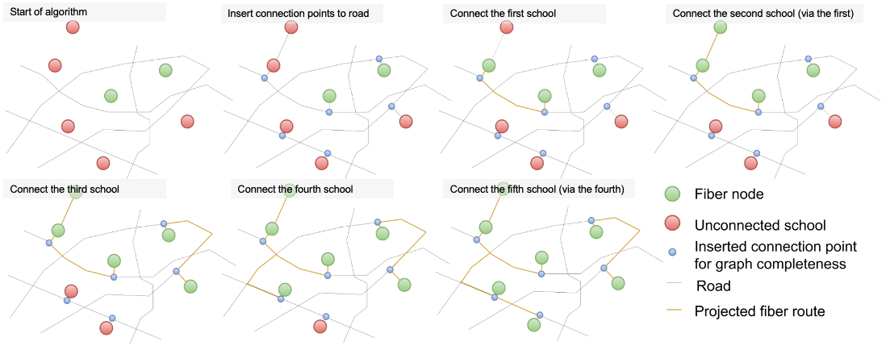
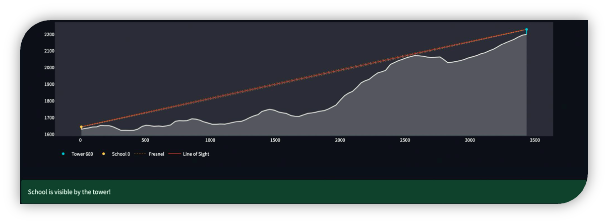

# Models

## Fibre

The fibre path model identifies the shortest and most cost-effective paths for connecting unconnected points of interest (POIs) to the existing optical fibre network using the road network. By minimizing the total length of fibre required, this model reduces overall deployment costs while efficiently extending connectivity.

To start with, the model connects POIs and fibre nodes to the existing road network using straight lines (unless they are already on the road network). Then, for each unconnected POI, it computes the shortest path to all fibre nodes. POIs that are already connected to the fibre network can also act as fibre nodes, from which the fibre network can be extended.

_Figure: Graph initialization and fibre path algorithm_

At each step of the algorithm, new connections are made between connected and unconnected points as long as the length of the new connection is below a specified threshold. For example, it can be specified that no single fibre line should be longer than 5 kilometres.

This approach enables economies of scale: POIs can act as relay points for neighbouring POIs, enabling connectivity without each one needing to connect directly to a transmission node. This approach optimises resource usage and simplifies network expansion.

In practice, this model is an application of Kruskal's algorithm to find a Minimum Spanning Tree (MST) in a network graph, where the edges are the road network and the vertices are POIs and fibre nodes. The MST ensures the minimal fibre path necessary to connect all relevant points while adhering to road network constraints related to distance.

_Figure: Output of fibre path algorithm_

### Feasibility

Fibre is considered a feasible technology for a POI if the algorithm is able to connect that POI to the fibre network, given the algorithm constraints - particularly the maximum length of fibre allowed per connection. In practice, fibre will not be feasible for POIs that are very far away from transmission nodes or other POIs.

### Required data inputs

- Points of interest
- Transmission nodes

The data on the road network is automatically fetched by the model from OpenStreetMap.

### Model parameters

| Parameter | Description | Value | Configurable in CPP |
|------------|-------------|-------|---------------------|
| max_connection_distance | Maximum allowable distance for a single connection (meters) | 50,000 | Yes |
| network_type | Type of road network to consider (e.g., all public roads) | all_public | No |
| distance_metric | Metric to compute distances in the network (e.g., 'length') | length | No |
| n_clusters | Number of geographical clusters used for analysis (1 means no clustering) | 1 | No |
| use_road_data | Whether to use road network data for distance calculations | True | No |
_Non-configurable parameters are hard-coded to the values shown above._

### Fibre cost function

The fibre cost function is summarized below. The CAPEX cost for each POI is dependent on the amount of fibre required to connect that school.

| Parameter | Description | Value | Configurable in CPP |
|------------|-------------|---------------|---------------------|
| hw_setup_cost_fibre | Hardware setup cost per point of interest (USD/POI) | 500 | Yes |
| focl_constr_cost_fibre | Fibre optic cable construction cost per kilometre (USD/km) | 8,000 | Yes |
| reinv_period_fibre | Hardware reinvestment period (years) | 3 | Yes |
| an_hw_maint_and_repl_fibre | Annual hardware maintenance and replacement cost (fraction of initial CAPEX) | 0.1 | Yes |
| an_isp_fees_one_mbps_fibre | Annual transit bandwidth cost (USD per Mbps per year) | 31.8 | Yes |
| an_traffic_fees_one_mbps_fibre | Annual access bandwidth cost (USD per Mbps per year) | 0 | Yes |

_Non-configurable parameters are hard-coded to the values shown above._

_Figure: Fibre cost function_

## Cellular

The cellular model relies on cellular coverage analysis. If mobile coverage contours are provided, such as in the Figure below, then the coverage status is determined by overlaying the POIs over this layer.

_Figure: Mobile coverage contours_

If no mobile coverage contours are provided, then the locations of cell sites have to be provided and mobile coverage is determined by the distance from a cell site. Each site is assumed to provide coverage within a specified maximum radius, which is controlled by the model parameter Coverage radius around cell tower.

### Feasibility

Cellular is considered a feasible technology for a POI if it is within the cellular coverage area (3G, 4G or 5G).

### Required data inputs

- Points of interest
- Mobile coverage contours

### Model parameters

| Parameter | Description | Value | Configurable in CPP |
|-----------|-------------|---------------|-------------------|
| coverage_distance | Distance around cell sites to assume coverage if no map is available (meters) | 1,000 | No |
| coverage_type | Default network type for coverage buffers if no map is available | 4G | No |
| radii | List of radii (km) used for coverage analysis | [1, 2, 3, 5] | No |
| radius_for_demand | Radius used to aggregate demand around a point | 1 | No |
| dataset_year | Year of the WorldPop population dataset | 2025 | No |
| overlap_allowed | Allow overlap in buffer areas | False | No |
_Non-configurable parameters are hard-coded to the values shown above._

### Cellular cost function

The cellular cost function is summarized below.

| Parameter | Description | Value | Configurable in CPP |
|------------|-------------|---------------|---------------------|
| hw_setup_cost_p2area | Hardware setup cost per point of interest (USD/POI) | 80 | Yes |
| an_hw_maint_and_repl_p2area | Annual hardware maintenance and replacement cost (fraction of initial CAPEX) | 0.1 | Yes |
| an_isp_fees_one_mbps_p2area | Annual ISP fees (USD per Mbps per year) | 24 | Yes |
| an_traffic_fees_one_mbps_p2area | Annual traffic fees (USD per Mbps per year) | 0 | Yes |
| reinv_period_p2area | Reinvest into hardware after (Years) | 3 | Yes |
_Non-configurable parameters are hard-coded to the values shown above._

_Figure: Cellular cost function_

## Point-to-Point

The point-to-point model evaluates the feasibility of establishing radio links between points of interest (POIs) and cell sites using visibility analysis. This involves assessing whether the line of sight between a POI and a cell site is obstructed, ensuring that only feasible links are considered for deployment. The analysis uses open topography data from the [Shuttle Radar Topography Mission](https://www.earthdata.nasa.gov/data/instruments/srtm) (SRTM), which provides 30-meter resolution elevation data. The maximum visibility limit is set at 35 kilometres, meaning that cell sites beyond this distance are not considered visible or feasible for point-to-point connectivity.

_Figure: Visible cell site_

_Figure: Obstructed cell site_

### Feasibility

Point-to-point microwave is considered a feasible technology for a POI if at least one cell site (or another POI) is visible from the POI.

### Required data inputs

- Points of interest
- Cell sites

### Model parameters

| Parameter | Description | Value | Configurable in CPP |
|------------|-------------|---------------|---------------------|
| search_radius | Search radius for nearby cell sites (kilometres) | 35 | No |
| poi_antenna_height | Height of the POI antenna (meters) | 15 | No |
| num_visible | Number of visible cell sites to consider | 1 | No |
| allowed_radio_types | Allowed radio types for cell sites | ['4G', '5G'] | No |
_Non-configurable parameters are hard-coded to the values shown above._

### Point-to-point cost function

The point-to-point cost function is summarized below. There are added complexities in this cost function due to the presence of additional physical infrastructure, such as retransmission towers and backhaul links - as well as additional one-time and annual license fees.

| Parameter | Description | Value | Configurable in CPP |
|------------|-------------|-------|---------------------|
| access_link_bandwidth_p2p | Bandwidth per access link (MHz) | 10 | Yes |
| an_hw_maint_and_repl_p2p | Annual hardware maintenance and replacement costs (fraction of hardware CAPEX) | 0.05 | Yes |
| an_isp_fees_one_mbps_p2p | Access ISP fees (USD per Mbps per year) | 24 | Yes |
| an_license_fee_1mhz_p2p | Annual recurring license fee for 1 MHz (USD per MHz per year) | 100 | Yes |
| an_traffic_fees_one_mbps_p2p | Annual traffic fee (USD per Mbps per year) | 0 | Yes |
| hw_setup_cost_p2p | Hardware setup cost, including access links and assuming one hop per POI (USD per POI) | 500 | Yes |
| one_time_license_fee_1mhz_p2p | One-time license fee for 1 MHz (USD per MHz) | 500 | Yes |
| reinv_period_p2p | Reinvest into hardware after (Years) | 5 | Yes |
_Non-configurable parameters are hard-coded to the values shown above._

_Figure: Point to point cost function_

## Satellite

There is no specific analysis used to assess the feasibility of satellite connections. They are considered always feasible in this version of the platform.

### Feasibility

Satellite connections are always considered feasible.

### Required data inputs

- Points of interest

### Satellite cost function

The satellite cost function is summarized below.

| Parameter | Description | Value | Configurable in CPP |
|------------|-------------|-------|---------------------|
| hw_setup_cost_sat | Hardware setup cost per point of interest (USD/POI) | 3,000 | Yes |
| an_hw_maint_and_repl_sat | Annual hardware maintenance and replacement costs (fraction of hardware CAPEX) | 0.04 | Yes |
| an_isp_fees_one_mbps_sat | Access ISP fees (USD per Mbps per year) | 24 | Yes |
| an_traffic_fees_one_mbps_sat | Annual traffic fee (USD per Mbps per year) | 0 | Yes |
| reinv_period_sat | Reinvest into hardware after (Years) | 5 | Yes |
_Non-configurable parameters are hard-coded to the values shown above._

_Figure: Satellite cost function_

