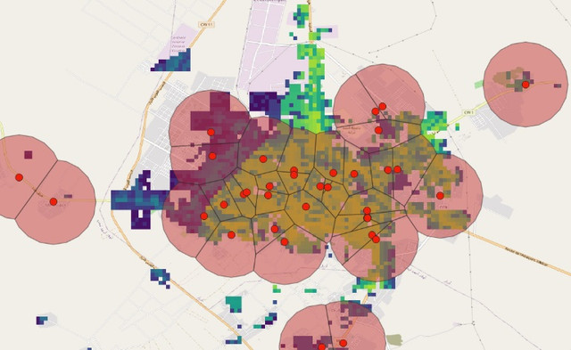
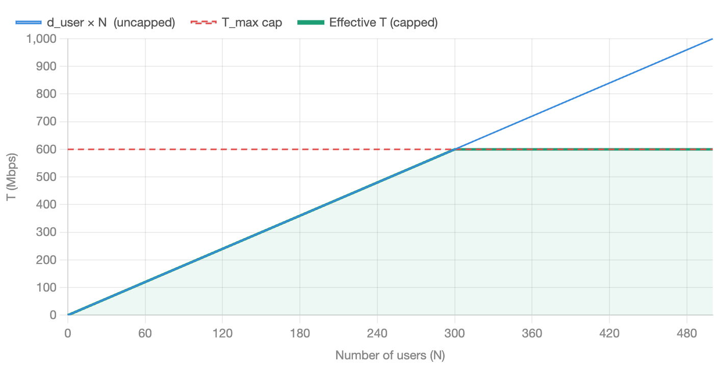
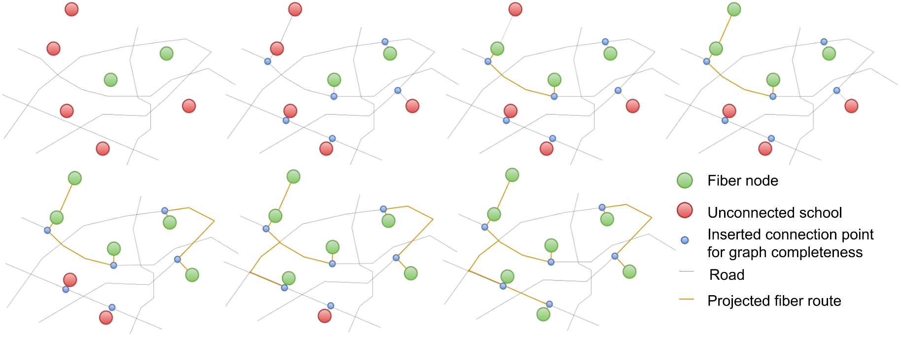
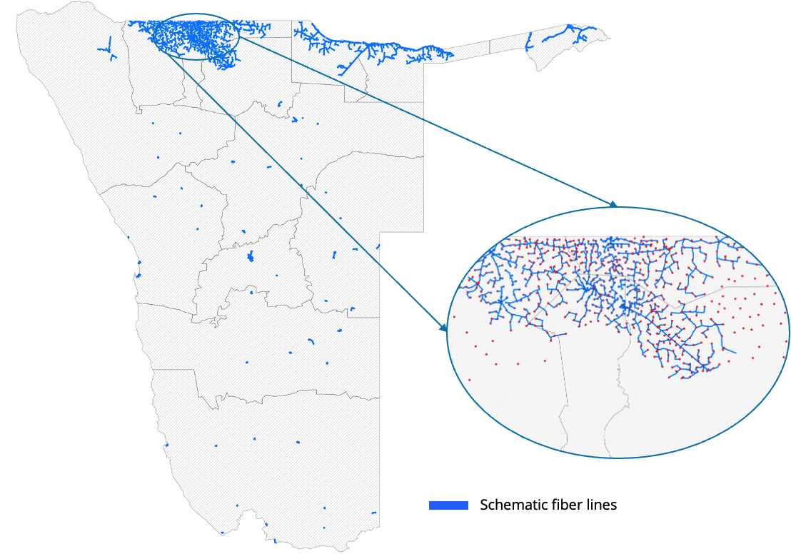
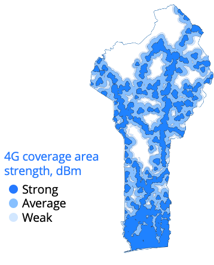
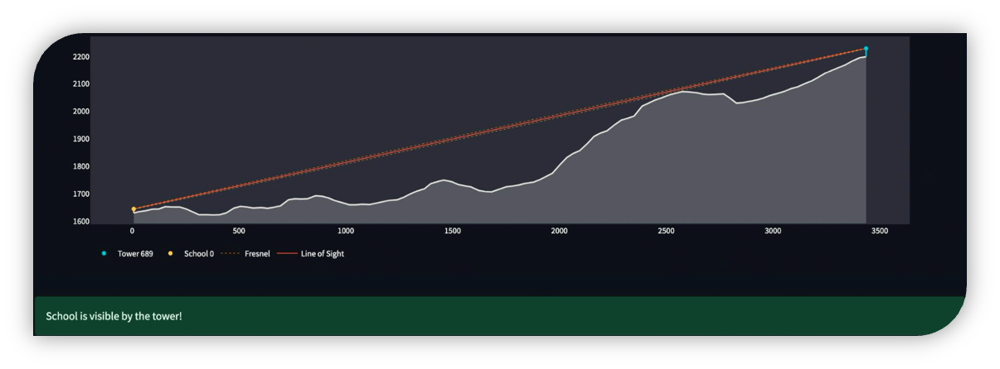
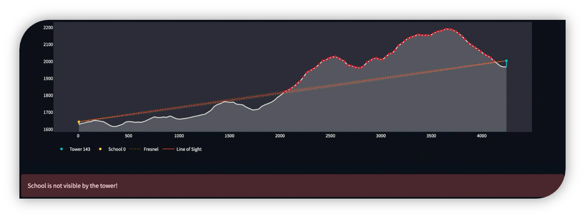

# Models

## Demand

The demand model estimates the number of people residing within a defined radius of each point of interest (POI) by leveraging granular population datasets. This serves two purposes: approximating the number of active internet users at each POI, and deriving the total throughput (in Mbps) that any technology option must provide to meet that demand.

If the input data includes values for `total_mbps` (total bandwidth demand in Mbps) or `number_of_users` (peak concurrent internet users), those user-supplied values are used directly. Otherwise, both quantities are estimated by the demand model as described below.

**Number of users** is estimated as:

$$N_{\text{users}} = P_{\text{radius}} \times r_{\text{user}}$$

where \(P_{\text{radius}}\) is the population within `radius_for_demand` km of the POI, and \(r_{\text{user}}\) is the user rate (e.g. the share of the population of school age, for a school connectivity analysis).

_Figure: Population buffers used to estimate the number of users around points of interest._

**Total throughput demand** is estimated as:

$$T = \min\left(d_{\text{user}} \times N_{\text{users}},\ T_{\text{max}}\right)$$

where \(d_{\text{user}}\) is the per-user demand in Mbps, and \(T_{\text{max}}\) is a cap to avoid unrealistically high estimates:

$$T_{\text{max}} = \max\left(T_{\text{fiber}},\ T_{\text{p2area}},\ T_{\text{p2p}},\ T_{\text{satellite}}\right)$$

This cap is defined as the highest throughput achievable across any of the supported technology options.

_Figure: Population buffers used to estimate the number of users around points of interest._

### Required data inputs

- Points of interest (POI layer)

Population data is automatically retrieved by the model from [WorldPop](https://hub.worldpop.org/geodata/listing?id=136).

### Model parameters

| Parameter | Description | Default | Configurable in CPP |
|---|---|---|---|
| `radii` | Buffer radii (km) around each POI; all distances are reported in the outputs | [1, 3, 5] | No |
| `radius_for_demand` | The radius (km) used to estimate $N_{\text{users}}$, drawn from `radii` | 1 | No |
| `mbps_demand_per_user` | Per-user bandwidth demand $d_{\text{user}}$ (Mbps) | 1.5 | Yes |
| `user_rate` | Share of the local population counted as users $r_{\text{user}}$ (1 = entire population) | 1 | No |
| `overlap_allowed` | Whether buffers around POIs may overlap; if `False`, overlapping areas are assigned to a single POI to avoid double-counting | False | No |
| `max_throughput_fiber` | Maximum achievable download speed via fibre (Mbps) | 15,000 | No |
| `max_throughput_p2area` | Maximum achievable download speed via cellular (Mbps) | 200 | No |
| `max_throughput_p2p` | Maximum achievable download speed via point-to-point microwave (Mbps) | 400 | No |
| `max_throughput_sat` | Maximum achievable download speed via satellite (Mbps) | 200 | No |

_Non-configurable parameters are hard-coded to the default values shown above._

## Fibre

The fibre path model identifies the shortest paths for connecting unconnected points of interest (POIs) to the existing optical fibre network using the road network. By minimizing the total length of fibre required, this model reduces overall deployment costs while efficiently extending connectivity.

To start with, the model connects POIs and fibre nodes to the existing road network using straight lines (unless they are already on the road network). Then, for each unconnected POI, it computes the shortest path to all fibre nodes. POIs that are already connected to the fibre network can also act as fibre nodes, from which the fibre network can be extended.

_Figure: Graph initialization and fibre path algorithm_

At each step of the algorithm, new connections are made between connected and unconnected points as long as the length of the new connection is below a specified threshold. For example, it can be specified that no single fibre line should be longer than 5 kilometres.

This approach enables economies of scale: POIs can act as relay points for neighbouring POIs, enabling connectivity without each one needing to connect directly to a transmission node. This approach optimises resource usage and simplifies network expansion.

In practice, this model is an application of Kruskal's algorithm to find a Minimum Spanning Tree (MST) in a network graph, where the edges are the road network and the vertices are POIs and fibre nodes. The MST ensures the minimal fibre path necessary to connect all relevant points while adhering to road network constraints related to distance.

_Figure: Output of fibre path algorithm_

### Feasibility

Fibre is considered a feasible technology for a POI if the algorithm is able to connect that POI to the fibre network, given the algorithm constraints - particularly the maximum length of fibre allowed per connection. In practice, fibre will not be feasible for POIs that are very far away from transmission nodes or are unreachable by road.

### Required data inputs

- Points of interest
- Transmission nodes

The data on the road network is automatically fetched by the model from OpenStreetMap.

### Model parameters

| Parameter | Description | Default | Configurable in CPP |
|---|---|---|---|
| `max_connection_distance` | Maximum allowable distance for a single connection (metres) | 50,000 | Yes |
| `network_type` | Type of road network to consider | `all_public` | No |
| `distance_metric` | Metric used to compute distances in the network | `length` | No |
| `n_clusters` | Number of geographical clusters used for analysis (1 = no clustering) | 1 | No |
| `use_road_data` | Whether to use road network data for distance calculations | `True` | No |

_Non-configurable parameters are hard-coded to the default values shown above._

### Fibre cost function

The fibre cost function is summarised below. The CAPEX cost for each POI depends on the length of fibre required to connect it.

| Parameter | Description | Default | Configurable in CPP |
|---|---|---|---|
| `hw_setup_cost_fibre` | Hardware setup cost per POI (USD) | 500 | Yes |
| `focl_constr_cost_fibre` | Fibre optic cable construction cost (USD/km) | 8,000 | Yes |
| `reinv_period_fibre` | Hardware reinvestment period (years) | 3 | Yes |
| `an_hw_maint_and_repl_fibre` | Annual hardware maintenance and replacement cost (fraction of initial CAPEX) | 0.1 | Yes |
| `an_isp_fees_one_mbps_fibre` | Annual transit bandwidth cost (USD/Mbps/year) | 31.8 | Yes |
| `max_throughput_fiber` | Maximum achievable download speed via fibre (Mbps). The throughput is capped at this value. | 15,000 | No |

_Non-configurable parameters are hard-coded to the values shown above._

_Figure: Fibre cost function_

## Cellular

The cellular model relies on cellular coverage analysis. If mobile coverage contours are provided, such as in the Figure below, then the coverage status is determined by overlaying the POIs over this layer.

_Figure: Mobile coverage contours_

If no mobile coverage contours are provided, then the locations of cell sites have to be provided and mobile coverage is determined by the distance from a cell site. Each site is assumed to provide coverage within a specified maximum radius, which is controlled by the model parameter `coverage_distance`.

### Feasibility

Cellular is considered a feasible technology for a POI if it is within the cellular coverage area (3G, 4G or 5G).

### Required data inputs

- Points of interest
- Mobile coverage contours or Cell Sites

### Model parameters

| Parameter | Description | Default | Configurable in CPP |
|---|---|---|---|
| `coverage_distance` | Distance around cell sites used to approximate coverage when no map is available (metres) | 1,000 | No |
| `coverage_type` | Default network type for coverage buffers when no map is available | `4G` | No |

_Non-configurable parameters are hard-coded to the default values shown above._

### Cellular cost function

The cellular cost function is summarised below.

| Parameter | Description | Default | Configurable in CPP |
|---|---|---|---|
| `hw_setup_cost_p2area` | Hardware setup cost per POI (USD) | 80 | Yes |
| `an_hw_maint_and_repl_p2area` | Annual hardware maintenance and replacement cost (fraction of initial CAPEX) | 0.1 | Yes |
| `an_isp_fees_one_mbps_p2area` | Annual transit bandwidth cost (USD/Mbps/year) | 24 | Yes |
| `reinv_period_p2area` | Hardware reinvestment period (years) | 3 | Yes |
| `max_throughput_p2area` | Maximum achievable download speed via cellular (Mbps). The throughput is capped at this value. | 200 | No |

_Non-configurable parameters are hard-coded to the default values shown above._

_Figure: Cellular cost function_

## Point-to-Point

The point-to-point model evaluates the feasibility of establishing radio links between points of interest (POIs) and cell sites using visibility analysis. This involves assessing whether the line of sight between a POI and a cell site is obstructed, ensuring that only feasible links are considered for deployment. The analysis uses open topography data from the [Shuttle Radar Topography Mission](https://www.earthdata.nasa.gov/data/instruments/srtm) (SRTM), which provides 30-meter resolution elevation data. The maximum visibility limit is set at 35 kilometres, meaning that cell sites beyond this distance are not considered visible or feasible for point-to-point connectivity.

_Figure: Visible cell site_

_Figure: Obstructed cell site_

### Feasibility

Point-to-point microwave is considered a feasible technology for a POI if at least one cell site (or another POI) is visible from the POI.

### Required data inputs

- Points of interest
- Cell sites

### Model parameters

| Parameter | Description | Default | Configurable in CPP |
|---|---|---|---|
| `search_radius` | Search radius for nearby cell sites (km) | 35 | No |
| `poi_antenna_height` | Height of the POI antenna (metres) | 15 | No |
| `num_visible` | Number of visible cell sites to consider | 1 | No |
| `allowed_radio_types` | Allowed radio types for cell sites | `['2G','3G','4G','5G']` | No |

_Non-configurable parameters are hard-coded to the default values shown above._

### Point-to-point cost function

The point-to-point cost function is summarised below. Additional complexities arise from physical infrastructure such as retransmission towers and backhaul links, as well as one-time and recurring licence fees.

| Parameter | Description | Default | Configurable in CPP |
|---|---|---|---|
| `access_link_bandwidth_p2p` | Bandwidth per access link (MHz) | 10 | Yes |
| `an_hw_maint_and_repl_p2p` | Annual hardware maintenance and replacement cost (fraction of hardware CAPEX) | 0.05 | Yes |
| `an_isp_fees_one_mbps_p2p` | Annual transit bandwidth cost (USD/Mbps/year) | 24 | Yes |
| `an_license_fee_1mhz_p2p` | Annual recurring licence fee (USD/MHz/year) | 100 | Yes |
| `hw_setup_cost_p2p` | Hardware setup cost, including access links and assuming one hop per POI (USD/POI) | 500 | Yes |
| `one_time_license_fee_1mhz_p2p` | One-time licence fee (USD/MHz) | 500 | Yes |
| `reinv_period_p2p` | Hardware reinvestment period (years) | 5 | Yes |
| `max_throughput_p2p` | Maximum achievable download speed via point-to-point microwave (Mbps). The throughput is capped at this value. | 400 | No |

_Non-configurable parameters are hard-coded to the default values shown above._

_Figure: Point to point cost function_

## Satellite

There is no specific analysis used to assess the feasibility of satellite connections. They are considered always feasible in this version of the platform.

### Feasibility

Satellite connections are always considered feasible.

### Required data inputs

- Points of interest

### Satellite cost function

The satellite cost function is summarised below.

| Parameter | Description | Default | Configurable in CPP |
|---|---|---|---|
| `hw_setup_cost_sat` | Hardware setup cost per POI (USD) | 3,000 | Yes |
| `an_hw_maint_and_repl_sat` | Annual hardware maintenance and replacement cost (fraction of hardware CAPEX) | 0.04 | Yes |
| `an_isp_fees_one_mbps_sat` | Annual transit bandwidth cost (USD/Mbps/year) | 24 | Yes |
| `reinv_period_sat` | Hardware reinvestment period (years) | 5 | Yes |
| `max_throughput_sat` | Maximum achievable download speed via satellite (Mbps). The throughput is capped at this value. | 200 | No |

_Non-configurable parameters are hard-coded to the default values shown above._

_Figure: Satellite cost function_

